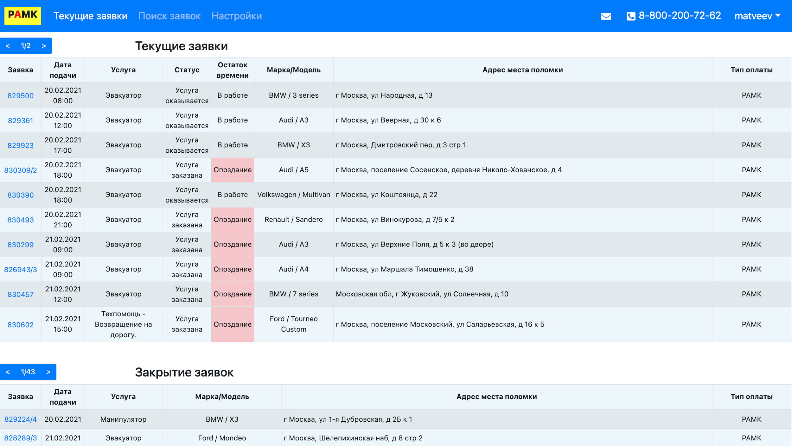
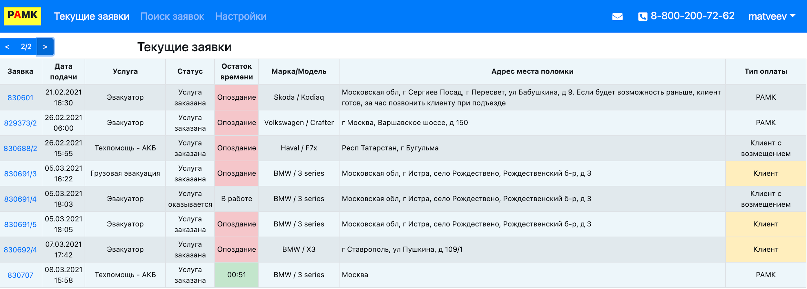

# Экран "Текущие заявки"
После входа в систему пользователь автоматически переходит на главный экран системы - “Текущие заявки” (Рис.2).

В верхней части экрана выводится строка меню, ниже отображается область работы с заявками.

* В правой части меню отображается:
    - логин сотрудника, вошедшего в систему
    - номер телефона
    - кнопка отправки письма
* В левой части меню отображаются ссылки на страницы:
    - Текущие заявки
    - Поиск заявок
    - Настройки
Экран “Текущие заявки” разделен на две области:
1. Таблица “Текущие заявки”, в которой выводятся новые заявки и заявки в работе.
2. Таблица “Закрытие заявок”, в которой выводятся выполненные заявки, которые необходимо закрыть.

### Рис.2 Экран “Текущие заявки”

Работа со списком текущих заявок
Все активные заявки отображаются в таблице на экране “Текущие заявки”. В столбцах
таблицы выводится часть необходимой информации по заявке.
* Заявка
    - выводится номер кейса в системе компании РАМК.
* Дата подачи
    - выводится дата и время, в которое клиент ожидает получить помощь.
* Услуга
    - выводится услуга, которую необходимо предоставить клиенту
* Статус
    - выводится статус выполнения услуги
* Остаток времени
    - выводятся разные значения в зависимости от ситуации:
        + таймер со временем, которое осталось до момента, когда клиент ожидает получить услугу
        + выделенное красным цветом слово “Опоздание” в случае, когда ожидаемое время оказания услуги наступило, но к клиенту еще не приехали (либо водитель не отзвонился, что он на месте)
        + статус “В работе” в случае, когда услуга в процессе оказания
* Марка/Модель
    - выводится марка и модель автомобиля клиента
* Адрес места поломки
    - выводится адрес местонахождения клиента
* Тип оплаты
    - выводится информация о том, кто оплачивает услугу

**Внимание!** Заявки отсортированы в таблице по ожидаемой дате выполнения, начиная от самой ранней.

**Внимание!** В таблице на одной странице по умолчанию выводится 10 заявок. Если из больше 10, то для того, чтобы увидеть вновь поступившие заявки, необходимо перейти на следующую страницу при помощи элемента перелистывания страниц в верхнем левом углу таблицы

### Рис.3 Вторая страница с заявками
