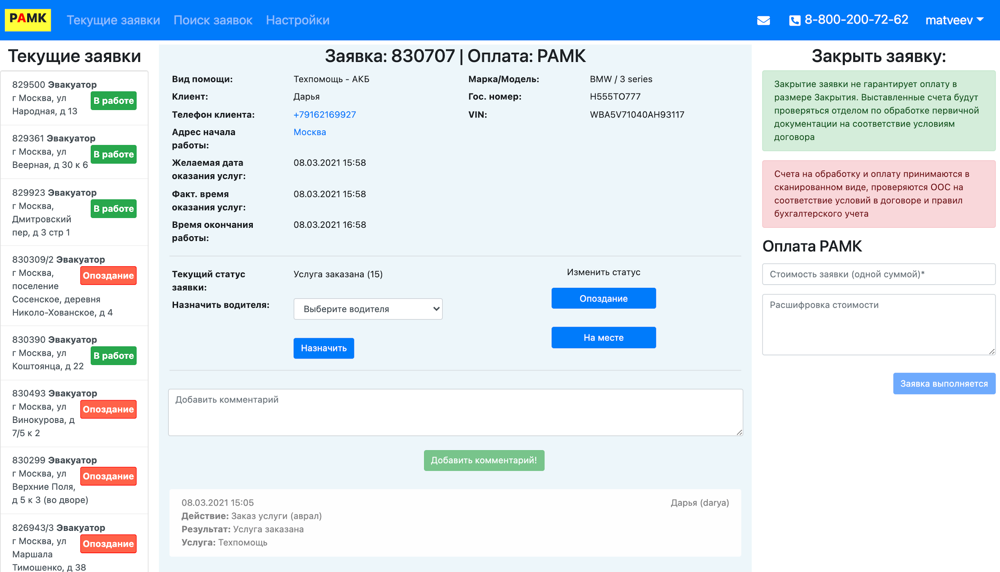
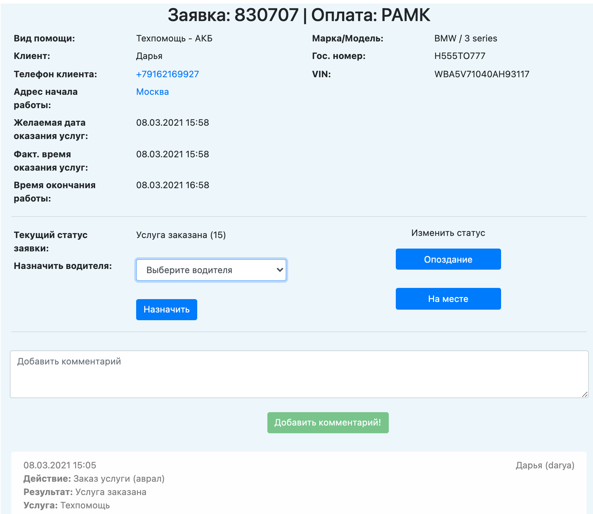
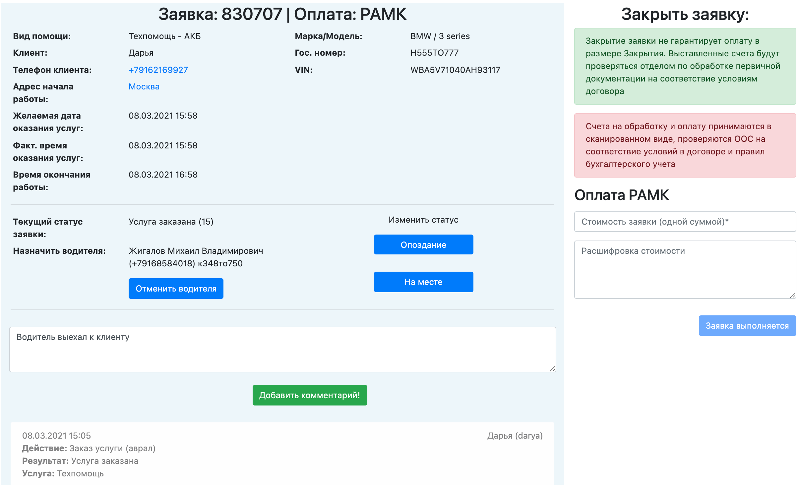
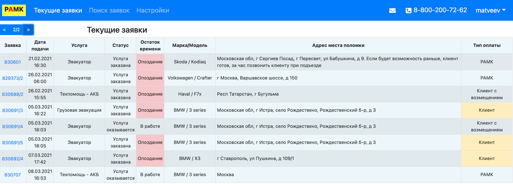
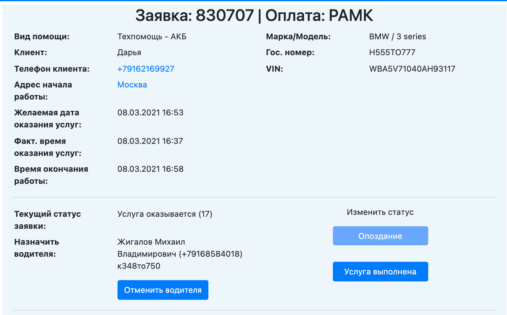
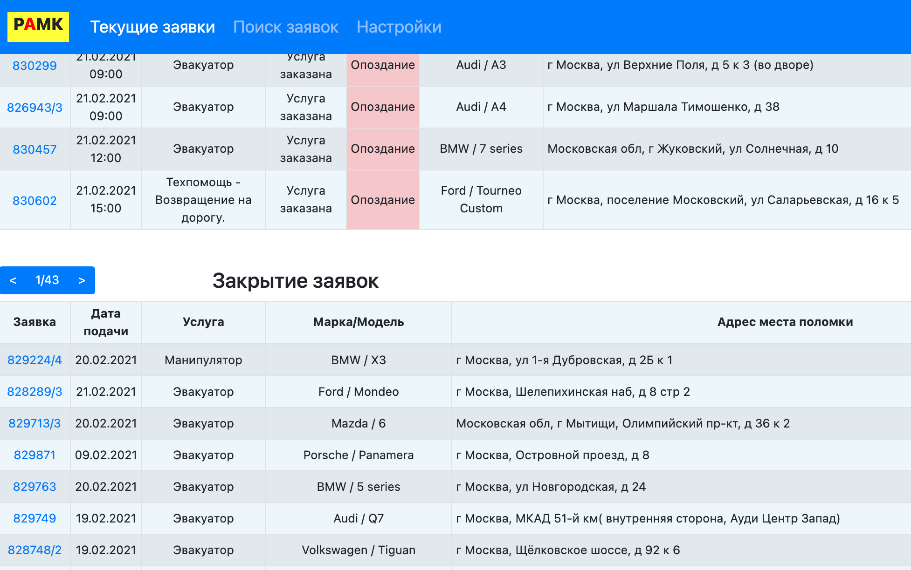

# Работа с заявкой
Для того, чтобы начать работу с конкретной заявкой, требуется в таблице нажать на
соответствующий номер в столбце “Заявка”. После этого вы попадете на экран работы
с Заявкой (Рис.4)

### Рис.4 Экран работы с заявкой

В верхней области экрана отображаются данные о клиенте, его автомобиле, желаемая
дата оказания услуги.

В нижней области экрана отображаются инструменты для работы с заявкой.

## Назначение на исполнителя
Для того, чтобы начать выполнение заявки, необходимо назначить исполнителя услуги.
Для этого выбираем исполнителя в поле “Назначить водителя”, а затем нажимаем
кнопку “Назначить” (Рис.5).

Рис.5 Назначение исполнителя

После этого на экране работы с заявкой будет отображаться выбранный исполнитель.
При необходимости, исполнителя можно изменить, воспользовавшись кнопкой
“Отменить водителя” (Рис.6)

### Рис.6 Экран работы с заявкой с выбранным исполнителем

С момента назначения водителя начинается отсчет выполнения услуги. Услуга в
работе.
Опоздание водителя
В случае, если водитель опаздывает к клиенту, необходимо зафиксировать это
опоздание, предварительно уточнив у водителя причину и время, на которое он
опаздывает к клиенту.
Для того, чтобы зафиксировать опоздание:
1. На экране работы с заявкой нажимаем кнопку “Опоздание”
    - Появляется всплывающее окошко (Рис.7)
2. Указываем время опоздания
    - **Внимание!** Требуется указать на сколько минут (часов) опаздывает водитель
3. Указываем причину опоздания из выпадающего списка
    - **Внимание!** В случае, если выбрано значение “Другое”, необходимо написать комментарий в поле “Подробности”
4. Нажимаем кнопку “Подтвердить”

### Рис.7 Окно фиксации опоздания к клиенту

**Внимание!** После подтверждения, форма фиксации опоздания закроется, а оператору РАМК будет создана задача на согласование опоздания с клиентом. Что происходит после этого? У оператора какое-то время занимает согласование, что в это время делает партнер? Водитель продолжает ехать к клиенту? Как партнер узнает, что надо продолжить услугу, или клиент отказался?

## Начало оказания услуги

В системе необходимо зафиксировать момент фактического начала оказания услуги,
когда исполнитель приехал к клиенту. Для этого в Заявке нажимаем на кнопку “На
месте”.

### Рис.8 Заявка “В работе"

После этого статус меняется на “Услуга оказывается”, а в столбце “Остаток времени” появляется информация о том, что заявка “В работе”.

## Окончание оказания услуги
В системе необходимо зафиксировать момент фактического окончания оказания
услуги, когда исполнитель помог клиенту и услуга выполнена. Для этого в Заявке
нажимаем на кнопку “Услуга выполнена” (Рис.9).

### Рис.9 Окончание оказания услуги

## Закрытие заявок
Для того, чтобы закрыть заявку, необходимо на экране “Текущие заявки” нажать на
номер заявки, которую требуется закрыть (Рис.10).

### Рис.10 Таблица с заявками на закрытие

После нажатия на номер заявки попадаем на экран закрытия выбранной заявки (Рис.11).

Для закрытия необходимо заполнить форму справа, а именно:
1. Внести стоимость заявки
2. Внести расшифровку стоимости
3. Нажать на кнопку “Закрыть заявку”

### Рис.11 Форма закрытия заявки с типом оплаты “Смешанный”

